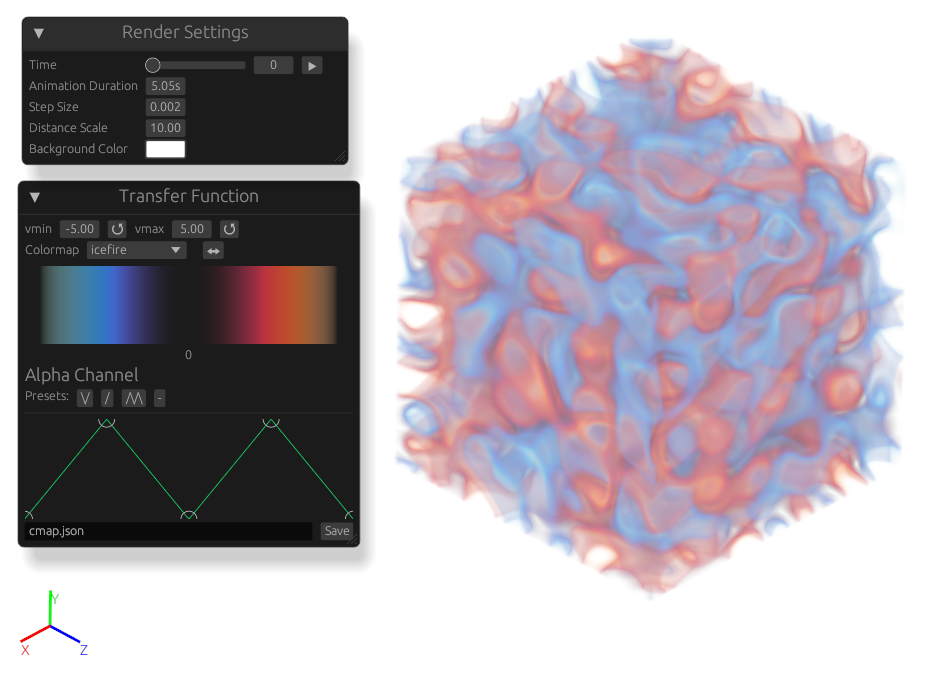

# vAPE - Interactive 4D volume visualization for APE



## Installation

with pip
```
pip install git+ssh://git@github.com/KeKsBoTer/vape.git@master
```

## Usage

**Viewer** (jupyter notebook)
```python
from vape import viewer
import numpy as np
from matplotlib import pyplot as plt

viewer(
    #[T,C,D,W,H]
    np.random.rand(1,1,32,32,32),
    plt.get_cmap("viridis"),   
)
```

**Render Image**
```python
import numpy as np
from vape import diverging_alpha, render
import matplotlib.pyplot as plt

colormap = diverging_alpha(plt.get_cmap("magma"))
img = render(
        # [T,D,H,W]
        np.random.rand(2,32,32,32).astype(np.float32),
        colormap,
        0.5, # timestep
        width=1024,
        height=1024,
    )

plt.imshow(img)
plt.axis("off")

plt.savefig("test.png", bbox_inches="tight", pad_inches=0)
plt.show()
```

